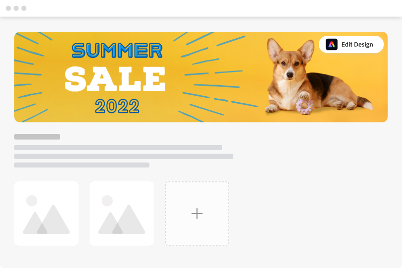
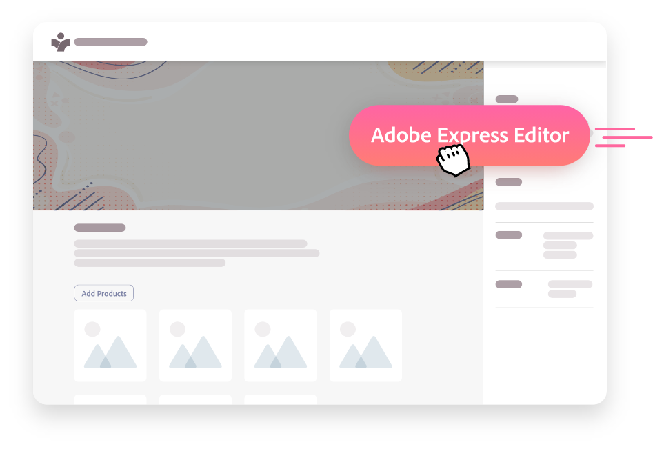
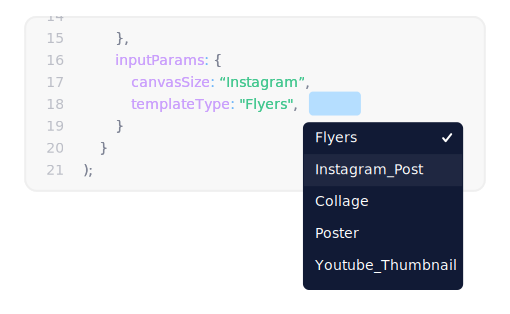

import "../../styles/main.css"
import AnimationVideo from "../videos/Adobe_full_seq.json";
import fullSeq from '../videos/Full_Sequence.mp4'
import { ArrowCodeSnippetSVG } from '../../components/arrow_asset.js'
import video1 from '../videos/Adobe-Acrobat-animation-v2.mp4'
import video2 from "../videos/Breakout-EDU-Animation v2.mp4"
import video3 from "../videos/Letter-Animation-v3.mp4"

<Hero slots="heading, text, image" variant="fullwidth"  videoSrcUrl={fullSeq}   className="express-editor-hero-block" svgEmbded= <ArrowCodeSnippetSVG /> />

# Empower your users to create standout content 

The Adobe Express Embed SDK’s Full Editor gives users everything they need to create content quickly and easily, without leaving your site.

<AnnouncementBlock slots="heading, text, button" className="announcement-embed-editor customer-need"/>

### No design experience required 

With the Adobe Express Full Editor, users start from thousands of templates to create professional-looking social content, flyers, banners, ads, and more. 

[Try the demo ](https://developer-stage.adobe.com/embed-sdk/docs/guides/ccx_editor/)

<TextBlock slots="image, heading,text" theme="lightest" headerElementType="h2" variantsTypePrimary='secondary' variantStyleFill = "outline" homeZigZag className="streamline_ability"/>

### Streamline your users’ workflows

With one-click, allow users to create and edit creative projects within iframes on your site. All of the tools and content they need are in one place.

<TextBlock slots="heading,text,image" theme="lightest" headerElementType="h2" variantsTypePrimary='secondary' variantStyleFill = "outline"   homeZigZag className=" zigzag-cta-two streamline_ability"/>

### Save your users time with templates 

The Adobe Express Full Editor unlocks an unparalleled collection of professionally designed templates, Adobe Stock* images, Adobe Fonts, and an array of creative assets for every need.

<TextBlock slots="image, heading,text" theme="lightest" headerElementType="h2" variantsTypePrimary='secondary' variantStyleFill = "outline" homeZigZag className="streamline_ability"/>

### Customize for your users’ needs 

Define where and how the Adobe Express Full Editor is launched to ensure users get to the right tools and templates when they need them.

<AnnouncementBlock slots="text, button" theme="lightest" className="announcement-embed-editor"/>

Learn more about using the embedded Express Editor

[View Documentation](https://adobe.io)

<TextBlock slots="heading,text" theme="light" headerElementType="h2" variantsTypePrimary='secondary' variantStyleFill = "outline" homeZigZag className="streamline_ability customer-experience"/>

### See it in action 

How does the Adobe Express Full Editor enhance user workflows? 

<Carousel slots="image,heading, text" repeat="3" delay="26000" theme="light" className="carousel" videoArr={[video1,video2,video3]} videosLenArr={[26000, 25000, 31000 ]} isVideoCarusel/>

#### Acrobat on web and desktop 

The Adobe Express Full Editor allows users to edit images and quickly create eye-catching cover and divider pages within Acrobat.

#### Breakout EDU 

Breakout EDU is an educational game platform for teachers and students that enables users to bring more creativity to virtual games with the Adobe Express Full Editor.

### Letter 

Letter is an email newsletter tool that helps content creators, designers, and developers make standout communications with the Adobe Express Full Editor.

<SummaryBlock slots=" image , heading, text, buttons" className="getting-started summary-block" />

## Getting started 

Embed the Adobe Express Full Editor on your website today to allow users to make standout content. 

- [Get started](https://developer-stage.adobe.com/embed-sdk/docs/guides/ccx_editor/)
