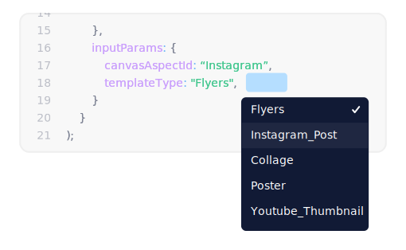

import "../styles/main.css"
import AnimationVideo from "./videos/Adobe_full_seq.json";
import fullSeq from './videos/Full_Sequence.mp4'
import { ArrowCodeSnippetSVG } from '../components/arrow_asset.js'
import video1 from './videos/Adobe-Acrobat-animation-v2.mp4'
import video2 from "./videos/Breakout-EDU-Animation v2.mp4"
import video3 from "./videos/Letter-Animation-v3.mp4"

<Hero slots="heading, text, image" variant="fullwidth"  videoSrcUrl={fullSeq}   className="express-editor-hero-block" svgEmbded= <ArrowCodeSnippetSVG /> />

# Unlock end users’ creativity with the Adobe Express Editor

Give users everything they need to create standout content quickly and easily, without having to leave your site.

<AnnouncementBlock slots="heading, text, button" className="announcement-embed-editor customer-need"/>

### Satisfy your customers’ creative needs

With Adobe Express Editor, users can create professional-caliber social posts, ads, banners, flyers, and more. No design experience required.

[Try the demo](https://adobe.io)

<TextBlock slots="image, heading,text" theme="lightest" headerElementType="h2" variantsTypePrimary='secondary' variantStyleFill = "outline" homeZigZag className="streamline_ability"/>

### Streamline your users’ workflows

With one-click, allow users to start creating and editing creative projects within iframes on your site. All of the tools and content they need are in one place.

<TextBlock slots="heading,text,image" theme="lightest" headerElementType="h2" variantsTypePrimary='secondary' variantStyleFill = "outline"   homeZigZag className=" zigzag-cta-two streamline_ability"/>

### Inspire confident creators

The Adobe Express Editor unlocks Adobe’s unparalleled collection of templates, Adobe Stock* images, Adobe Fonts, and an array of creative assets for every need.

<TextBlock slots="image, heading,text" theme="lightest" headerElementType="h2" variantsTypePrimary='secondary' variantStyleFill = "outline" homeZigZag className="streamline_ability"/>

### Forge the path to customer success

Customize where and how the Adobe Express Editor is launched to ensure users get to the right tools and templates.

<AnnouncementBlock slots="text, button" theme="lightest" className="announcement-embed-editor"/>

Learn more about using the embedded Express Editor

[View Documentation](https://adobe.io)

<TextBlock slots="heading,text" theme="light" headerElementType="h2" variantsTypePrimary='secondary' variantStyleFill = "outline" homeZigZag className="streamline_ability customer-experience"/>

### See it in action

How is the Adobe Express Editor improving customer experience?

<Carousel slots="image,heading, text" repeat="3" delay="26000" theme="light" className="carousel" videoArr={[video1,video2,video3]} videosLenArr={[26000, 25000, 31000 ]} isVideoCarusel/>

#### Acrobat on web and desktop

The Adobe Express Editor allows users to edit images and quickly create eye-catching cover and divider pages within Acrobat.

#### Breakout EDU

Breakout EDU is an educational game platform for teachers and students that enables users to bring more creativity to virtual games with the Adobe Express Editor.

### Letter

Letter is an email newsletter tool made for content creators, designers, and developers that helps users make standout communications with help from the Adobe Express Editor.

<SummaryBlock slots=" image , heading, text, buttons" className="getting-started summary-block" />

## Getting started

Embed the Adobe Express Editor on your own platform today and see how your users can start enhancing their operations.

- [Get Started](/quick-action)
- [Try the demo](https://adobe.io) 
