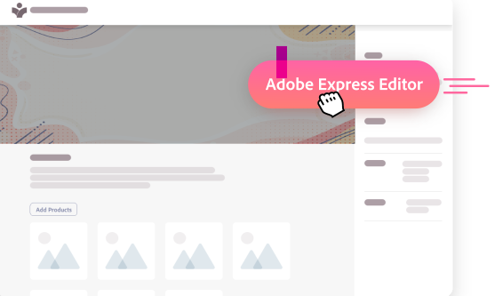
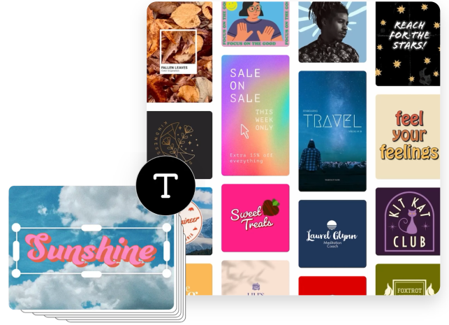
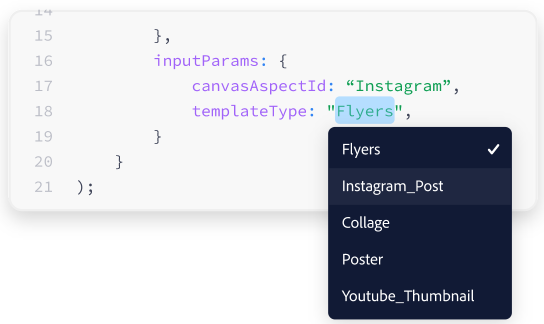

import "../styles/main.css"
import ResourceCardBlock from './express-editor/resourceCard.md';
import AnimationVideo from "./videos/Adobe_DCP_Marquee_Animation.json";

<Hero slots="heading, text,  assetsImg" customLayout variant="video" animationVideo={AnimationVideo} className=" editor-express-hero "/>

# Shorten time to market with Adobes ready-to-go Express Editor sdk

Give end users a quick and easy way to start a creative design workflow from within your applications

homeheroAssertImage

<AnnouncementBlock slots="heading, text, button" className="announcement"/>

### Answer Your Customers Creative Demands

With the Express Editor users can create Social Post, Banners, Flyers, Ads and More

[Try the demo](https://adobe.io)

<TextBlock slots="image, heading,text,buttons" theme="lightest" headerElementType="h2" variantsTypePrimary='secondary' variantStyleFill = "outline" homeZigZag className="streamline_ability"/>

### Streamline customers ability to get work done

Generate an easy one-click method for customers to start creating and edit designs

- [Learn more](https://adobe.io)

<TextBlock slots="heading,text,buttons,image" theme="lightest" headerElementType="h2" variantsTypePrimary='secondary' variantStyleFill = "outline"   homeZigZag className=" zigzag-cta-two streamline_ability"/>

### Insipre customer to create with confidence and efficency

Access to Adobe's expansive library of well designed creative assets, including Layout Templates,Fonts and Images

- [Learn more](https://adobe.io)

<TextBlock slots="image, heading,text,buttons" theme="lightest" headerElementType="h2" variantsTypePrimary='secondary' variantStyleFill = "outline" homeZigZag className="streamline_ability"/>

### Provide the path to customer success

Customize the editor experience to help customers focus on the templates and tools relavent to their use case

- [Learn more](https://adobe.io)

<TextBlock slots="heading" theme="light" className="see-it-action"/>

#### See it in Action

<WrapperComponent slots="content" repeat="1" theme="lightest" className="acrobat letter breakout"/>

<ResourceCardBlock/>

<TextBlock slots="heading,text,buttons,image" theme="lightest" headerElementType="h2" variantsTypePrimary='secondary' variantStyleFill = "outline"    className=" zigzag-cta-two streamline_ability adobeExpress-sdk"/>

### Getting Started

With the Adobe Express Embed SDK, lorem ipsum dolor sit amet, consetetur sadipscing elitr, sed diam nonumy eirmod tempor invidunt ut labour et dolre magna aliquyam erat, sed diam voluptua. at vera eos at accusam et justo

- [Get Started](https://adobe.io)
- [Try the demo](https://adobe.io)

