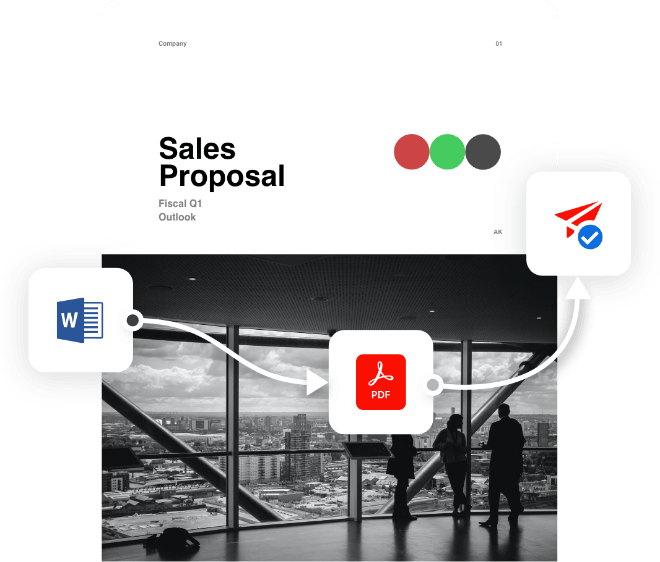
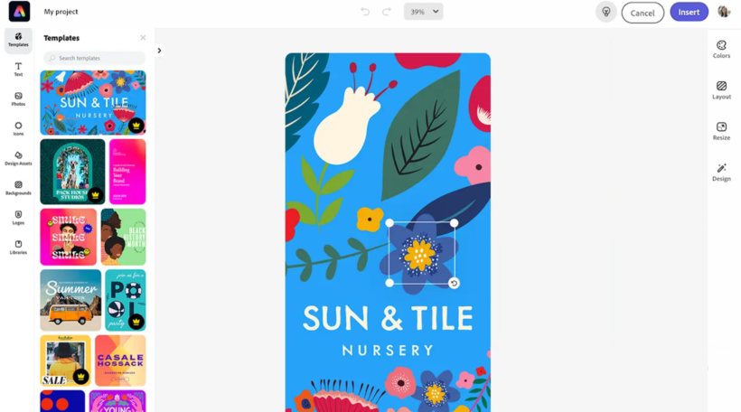
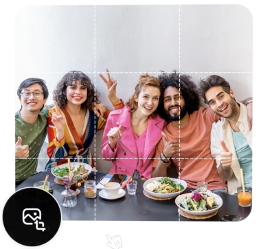

import "../styles/main.css"
import ResourceCardBlock from './embed-express-sdk/why-express-embed-sdk.md';
import AnimationVideo from "./videos/Adobe_DCP_Marquee_Animation.json";
import DesignForDeveloper from './embed-express-sdk/design-for-developer.md';

<Hero slots="image, icon, heading, text" variant="halfwidth"  className="embed-adobe "/>

# Embed Adobe's world class creative tools

Put the right creative tools and templates in the hands of your users where and where you need  

<DCSummaryBlock slots="text, buttons" theme="dark"  buttonPositionRight btnVariant="cta" className="How-to-get-started  ms-pa-page hero-below-compo ms-pa-summary-blade tryForFree" />

The Easy-to-integrate,customizable,all-in-one Javascript library that brings Adobe Express capabilities to all applications

- [Try the demo](https://documentservices.adobe.com/dc-integration-creation-app-cdn/main.html?api=pdf-services-api&source=pa#&sdid=6S3T74M5&mv=affiliate)

<TextBlock slots="image, heading,text,buttons" theme="lightest" headerElementType="h2" variantsTypePrimary='secondary' variantStyleFill = "outline" homeZigZag className="streamline_ability express-editor"/>

### Express Editor

Lorem ipsum dolor sit amet, consetetur sadipscing elitr, sed diam nonumy eirmod tempor invidunt ut labore et dolore magna aliquyam erat, sed diam voluptua.At vero eos et accusam et justo duo dolores et

- [Learn more](https://adobe.io)

<TextBlock slots="heading,text,buttons,image" theme="lightest" headerElementType="h2" variantsTypePrimary='secondary' variantStyleFill = "outline"   homeZigZag className=" zigzag-cta-two streamline_ability"/>

### Quick Actions

Lorem ipsum dolor sit amet, consetetur sadipscing elitr, sed diam nonumy eirmod tempor invidunt ut labore et dolore magna aliquyam erat, sed diam voluptua.At vero eos et accusam et justo duo dolores et

- [Learn more](https://adobe.io)

<ResourceCardBlock/>

<WrapperComponent slots="content" repeat="1" theme="lightest" className="acrobat letter breakout resource-card"/>

<DesignForDeveloper/>

<TextBlock slots="heading,text,buttons,image" theme="lightest" headerElementType="h2" variantsTypePrimary='secondary' variantStyleFill = "outline" className="zigzag-cta-two streamline_ability adobeExpress-sdk"/>

### Getting Started

With the Adobe Express Embed SDK, lorem ipsum dolor sit amet, consetetur sadipscing elitr, sed diam nonumy eirmod tempor invidunt ut labour et dolre magna aliquyam erat, sed diam voluptua. at vera eos at accusam et justo

- [Get Started](https://adobe.io)
- [Try the demo](https://adobe.io)

