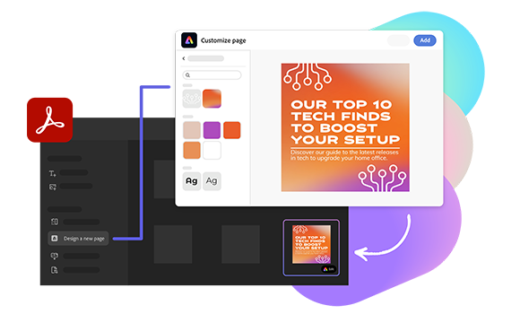
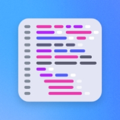

import "../styles/main.css"
import bgImg from './images/Summary-background.svg'
import TrytheDemo from "./express-embed-sdk/trydemo.md"
import EditingTool from "./express-embed-sdk/editing-tools.md"
import LearnMore from "./express-embed-sdk/learn-more.md"
import DesignForDeveloper from "./express-embed-sdk/design-for-develop.md"
import EditImageTable from "./express-embed-sdk/edit-photo.md"
import EditVideoTable from "./express-embed-sdk/edit-video.md"

<Hero slots="heading, text, buttons, assetsImg" customLayout variant="halfwidth" className="express-sdk-hero"/>

## Bring the best of Adobe express to your web application. 

Add powerful Adobe Express capabilities to your web application with Adobe Express Embed SDK, a customizable Javascript Library

- [Get started](https://developer.adobe.com/express-add-ons)
- [Try the demo ](https://developer.adobe.com/embed-sdk)

homeExpressLandingPage

<TitleBlock slots="heading" theme="lightest" className="right-capabilities" />

### Put the right capabilities forward.

<ImageTextBlock slots="image,heading,text" repeat="2" theme="lightest" className="editor-options" isCenter variantsTypePrimary='secondary'/>

## Have it all with the full editor.

Unlock access to thousands of templates, fonts, stock images, and videos right within your web application.

## Pick only what users need with quick actions.

Provide users with contextual and streamlined editing tools that match the ways they create.

<TrytheDemo />

<TitleBlock slots="heading" theme="light" className="users-work" />

### Create. Edit. Wherever your users work.

<WrapperComponent slots="content" repeat="1" theme="light" className="editingDescription" />

<EditingTool /> 

<WrapperComponent slots="content" repeat="1" theme="light" className="learnmoreBtn" />

<LearnMore />

<TextBlock slots="heading,text,image,buttons" theme="lightest" headerElementType="h2" variantsTypePrimary='secondary' variantStyleFill = "outline" homeZigZag className="explore unleash-power createTemplate" position="left" />

### Enable users to edit existing files, create from scratch, or create from templates.

After you embed the full editor, users can quickly and easily edit existing files or create new content like social media graphics, flyers, and ads from thousands of creative templates and design assets.

- [Learn more](https://demo.expressembed.com)

<TextBlock slots="heading,text,image,buttons" theme="lightest" headerElementType="h2" variantsTypePrimary='secondary' variantStyleFill = "outline" homeZigZag className="explore unleash-power viewDocs" position="right" />

### Save your users time with specific one-click editing tools.

Embed image and video editing capabilities with quick actions like Remove Background, Crop Image, and Merge Videos -- all powered by Adobe Express

- [View documentation](https://developer.adobe.com/embed-sdk/docs)

<TitleBlock slots="heading" theme="light" className="users-work" />

### Quick actions

<FormWrapperComponent slots="content" repeat="2" theme="light" className="editTable"/>

<EditImageTable/>

<EditVideoTable/>

<WrapperComponent slots="content" repeat="1" theme="dark" className="code-block bgBlue"/>

<DesignForDeveloper/>

<TextBlock slots="heading" className="announcement resourceHeader" theme="lightest"/>

### We've got your resources covered.

<MiniResourceCard slots="image,heading,link" repeat="3" theme="lightest" inRow="3" className="mini-card" />

### Community forum

[Link to blog post](https://adobe.ly/expressaddons)

### Partner with us

[Link to code samples](https://developer.adobe.com/express-add-ons/docs/samples/)

### Code sample

[Link to changelog](https://developer.adobe.com/express-add-ons/docs/references/changelog//)

<TeaserBlock  slots="heading,text,buttons" textColor="white" bgURL={bgImg} className="viewAddOn" variant="fullwidth"/>

### Let's do this.

view our developer quickstart guide to embedding Adobe Express capabilities into your web application, or reach out to partner with Adobe.

- [View quickstart guide](https://developer-stage.adobe.com/express/add-ons)
- [Partner with us](https://developer-stage.adobe.com/express/embed-sdk)