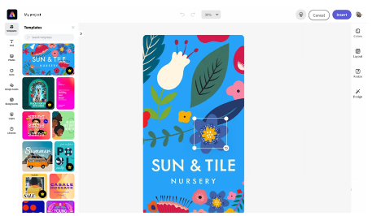

import "../styles/main.css"
import AnimationVideo from "./videos/Adobe_DCP_Marquee_Animation.json";
import WhyIntegrateSDK from "./embed-express-sdk/why-integrate-express-embed-sdk.md";
import DesignForDeveloper from "./embed-express-sdk/design-for-develop.md"
import VideoCrop from './videos/home_page_text_crop.mp4'
import img1 from './images/background-remove-layer-2-pexels-thyrone.png'
import img2 from './images/Quick action icon 1.svg'
import img3 from './images/Quick action icon 2.svg'
import img4 from './images/Video-Crop-still-frame.png'
import img5 from './images/Crop-objects.svg'
import img6 from './images/Quick action icon 3.svg'
import img7 from './images/Quick action icon 4.svg'

<Hero slots="image, icon, heading, text" variant="halfwidth" imagearray={[img1, img2, img3, img4, img5, img6, img7]} isCustomAnimation className="embed-adobe "/>

# Embed Adobe’s world class creative tools

Put the right creative tools and content in the hands of your users with the Adobe Express Embed SDK.

<DCSummaryBlock slots="text, buttons" theme="dark"  buttonPositionRight btnVariant="cta" className="How-to-get-started  ms-pa-page hero-below-compo ms-pa-summary-blade tryForFree" />

Bring powerful Adobe Express capabilities to any application with Express Embed SDK, a customizable JavaScript library.

- [Try the demo](https://documentservices.adobe.com/dc-integration-creation-app-cdn/main.html?api=pdf-services-api&source=pa#&sdid=6S3T74M5&mv=affiliate)

<TextBlock slots="image, heading,text,buttons" theme="lightest" headerElementType="h2" variantsTypePrimary='secondary' variantStyleFill = "outline" homeZigZag className="streamline_ability  express-editor"/>

    
### Enhance your site with Adobe Express

Allow your users to create standout content with beautiful templates and assets for social media content, logos, and more. It only takes a few lines of code.

- [Learn more](https://adobe.io)

<TextBlock slots="heading,text,buttons" theme="lightest" headerElementType="h2" variantsTypePrimary='secondary' videoSrcUrl={VideoCrop} variantStyleFill = "outline"   homeZigZag className=" zigzag-cta-two  streamline_ability"/>

### Quick Actions speed up users

Powered by Adobe Photoshop and Adobe Premiere, Quick Actions combine complex operations into one or two clicks, making resizing images, removing backgrounds, and merging videos easy.

- [Learn more](https://adobe.io)

<TitleBlock slots="heading" theme="lightest" className="sdk-title-block"/>

Why integrate the Express Embed SDK?

<WrapperComponent slots="content" repeat="1" theme="light" className="acrobat letter breakout QuickActionSDKDevelop "/>

<WhyIntegrateSDK/>

<WrapperComponent slots="content" repeat="1" theme="lightest" className="acrobat letter breakout resource-card "/>

<DesignForDeveloper/>

<SummaryBlock slots=" image , heading, text, buttons" className="getting-started sdk-getting-block" />

## Getting Started

Unlock Adobe Express editing capabilities for your users by embedding the SDK on your own platform. Read our developer quickstart guide or try the demo to get started.

- [Get Started](https://adobe.io)
- [Try the demo](https://adobe.io)