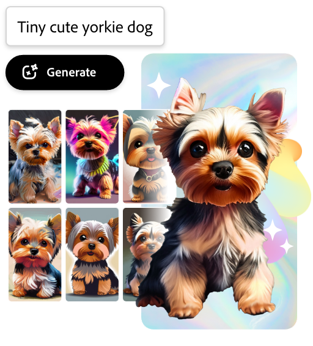
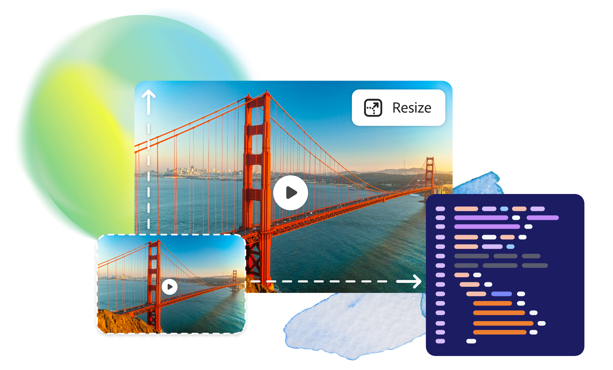
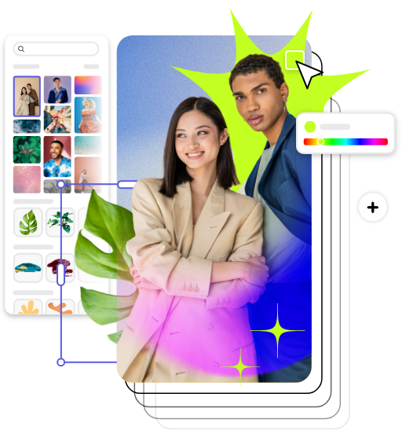
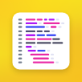

---
keywords:
  - Adobe Express Embed SDK
  - Adobe Express
  - Adobe Express embedded editor
  - Embed editor
  - Quick actions
  - Templates
  - Generative AI
  - Remove background
  - Resize image
  - Resize video
  - Crop image
  - Crop video
  - Trim video
  - Merge videos
  - Convert to GIF
  - Convert to MP4
  - Animate from audio
  - Convert to JPG
  - Convert to PNG
  - Convert to SVG
title: Adobe Express Embed SDK
description: Adobe Express Embed SDK is a customizable JavaScript library that allows you to embed powerful editing capabilities in your own web application.
contributors:
  - https://github.com/amandahuarng
---

import "../styles/main.css"
import TrytheDemo from "./express-embed-sdk/trydemo.md"
import EditingTool from "./express-embed-sdk/editing-tools.md"
import LearnMore from "./express-embed-sdk/learn-more.md"
import EditImageTable from "./express-embed-sdk/edit-photo.md"
import EditVideoTable from "./express-embed-sdk/edit-video.md"
import bgImg from "./images/Summary_BgImage.jpg"
import DesignForDeveloper from "./express-embed-sdk/design-for-develop.md"
import MobileEditPhoto from "./express-embed-sdk/mobile-edit-photo.md"
import MobileEditVideo from "./express-embed-sdk/mobile-edit-video.md"

<Hero slots="heading, text, buttons, assetsImg" customLayout variant="halfwidth" className="express-sdk-hero"/>

## Design, create, personalize - right inside your web app.

Empower your users to create with [Adobe Express](https://adobe.com/express) editing and AI capabilities for a more intuitive design experience.

- [Try the demo](https://demo.expressembed.com/)
- [Get started](https://developer.adobe.com/express/embed-sdk/docs/guides)

homeExpressLandingPage

<TitleBlock slots="heading" theme="light" className="users-work" />

### Give your users more to work with, in no time.

<WrapperComponent slots="content" repeat="1" theme="light" className="editingDescription" />

<EditingTool />

<WrapperComponent slots="content" repeat="1" theme="light" className="learnmoreBtn" />

<LearnMore />

<TitleBlock slots="heading" theme="light" className="chooseEdit" />

### Choose the editing experience that works for you.

<TextBlock slots="heading,text,image,buttons" theme="lightest" headerElementType="h2" variantsTypePrimary='secondary' variantStyleFill = "outline" homeZigZag className="explore unleash-power createTemplate" position="left" />

### A focus mode for content creation

Modules are task-oriented tools focused on what creators need, when they need it. Choose from Text to Image or Edit Image, with Text to Template module on the way.

- [Learn more](https://developer.adobe.com/express/embed-sdk/docs/guides/modules/)

<TextBlock slots="heading,text,image,buttons" theme="lightest" headerElementType="h2" variantsTypePrimary='secondary' variantStyleFill = "outline" homeZigZag className="qaImage" position="right" />

### Get instant results with one-click editing tools

Quick actions let you embed image and video editing capabilities like Remove Background, Crop Image, and Caption Video – all powered by Adobe Express.

- [Learn more](https://developer.adobe.com/express/embed-sdk/docs/guides/quick_actions/)

<TextBlock slots="heading,text,image,buttons" theme="lightest" headerElementType="h2" variantsTypePrimary='secondary' variantStyleFill = "outline" homeZigZag className="explore unleash-power createTemplate" position="left" />

### Bring the full set of Adobe Express capabilities to your users

The full Adobe Express editor lets users take advantage of Adobe’s professionally designed templates, stock images, fonts, text effects and add-ons.

- [Learn more](https://developer.adobe.com/express/embed-sdk/docs/guides/full_editor/)

<TitleBlock slots="heading" theme="light" className="users-work" />

### Quick actions

<FormWrapperComponent slots="content" repeat="2" theme="light" className="editTable"/>

<EditImageTable/>

<EditVideoTable/>

<WrapperComponent slots="content" repeat="1" theme="light" className="mobileEdit"/>

<MobileEditPhoto />

<WrapperComponent slots="content" repeat="1" theme="light" className="mobileEdit"/>

<MobileEditVideo />
 
<WrapperComponent slots="content" repeat="1" theme="lightest" className="code-block"/>

<DesignForDeveloper/>

<TitleBlock slots="heading" theme="lightest" className="users-work faq" />

### Frequently Asked Questions

<WrapperComponent slots="content" repeat="1" theme="lightest" className="accordion" />

<Accordion>

<AccordionItem header="What is the Adobe Express Embed SDK?" isChevronIcon  position="right" iconColor="#1473E6">

The Adobe Express Embed SDK is a customizable JavaScript library that lets partners integrate Adobe Express content editing and AI tools inside of their web app.

</AccordionItem>

<AccordionItem header="How much does it cost to use the Embed SDK?" isChevronIcon  position="right" iconColor="#1473E6">

For developers, there is no cost to use the Embed SDK. For users, access to Adobe Express features are based on the user’s entitlements.

</AccordionItem>

<AccordionItem header="How much time does it take to integrate the Embed SDK?" isChevronIcon  position="right" iconColor="#1473E6">

Development time varies, but we have seen small teams finish integrations in a week.

</AccordionItem>

</Accordion>

<TitleBlock slots="heading" theme="lightest" className="users-work" />

### We've got your resources covered.

<MiniResourceCard slots="image,heading,link" repeat="3" theme="lightest" inRow="3" className="mini-card support-tools" />

### Community forum

[Forums link](https://community.adobe.com/t5/adobe-express-embed-sdk/ct-p/ct-express-embed-sdk?page=1&sort=latest_replies&lang=all&tabid=all)

### FAQ

[FAQ](https://developer.adobe.com/express/embed-sdk/docs/guides/troubleshooting/faq/)

### Code samples

[Github repo with Embed SDK sample](https://github.com/AdobeDocs/cc-everywhere/tree/main/v4-sample/sample.md)

<TeaserBlock  slots="heading,text,buttons" textColor="white" bgURL={bgImg} className="viewAddOn" variant="fullwidth"/>

Let's do this.

View our developer quickstart guide to start embedding Adobe Express capabilities into your web application, or try the demo.

- [View quickstart guide](https://developer.adobe.com/express/embed-sdk/docs/guides/)
- [Try the demo](https://demo.expressembed.com)
