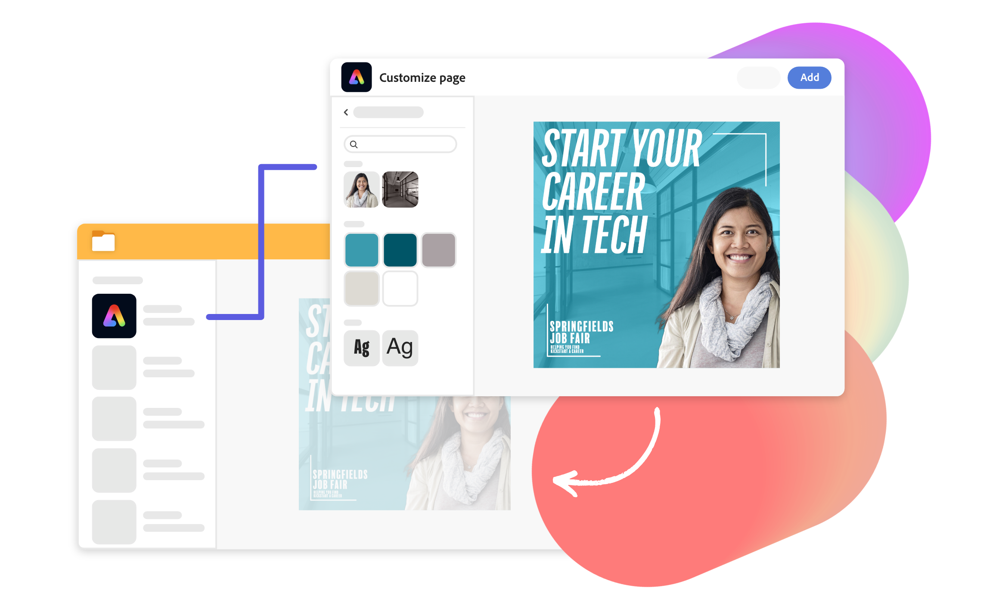
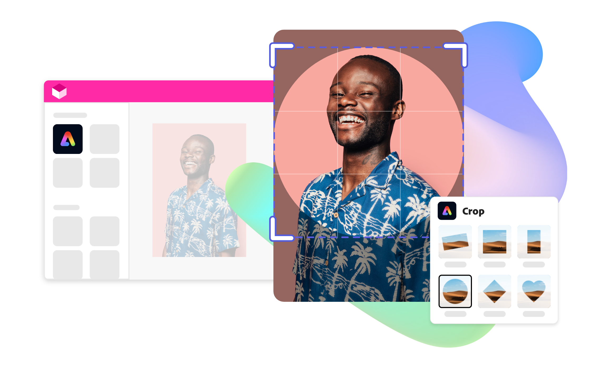
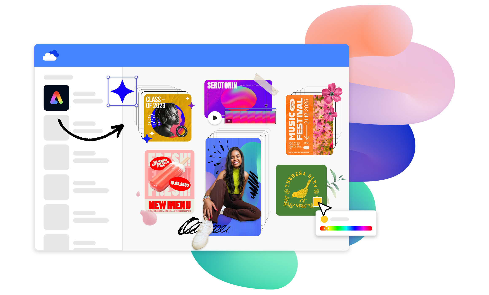

---
keywords:
  - Adobe Express Embed SDK
  - Adobe Express
  - Adobe Express embedded editor
  - Embed editor
  - Quick actions
  - Templates
  - Generative AI
  - Remove background
  - Resize image
  - Resize video
  - Crop image
  - Crop video
  - Trim video
  - Merge videos
  - Convert to GIF
  - Convert to MP4
  - Animate from audio
  - Convert to JPG
  - Convert to PNG
  - Convert to SVG
title: Adobe Express Embed SDK
description: Adobe Express Embed SDK is a customizable JavaScript library that allows you to embed powerful editing capabilities in your own web application.
contributors:
  - https://github.com/amandahuarng
---

import "../styles/main.css"
import TrytheDemo from "./express-embed-sdk/trydemo.md"
import EditingTool from "./express-embed-sdk/editing-tools.md"
import LearnMore from "./express-embed-sdk/learn-more.md"
import EditImageTable from "./express-embed-sdk/edit-photo.md"
import EditVideoTable from "./express-embed-sdk/edit-video.md"
import bgImg from "./images/Summary_BgImage.jpg"
import DesignForDeveloper from "./express-embed-sdk/design-for-develop.md"
import MobileEditPhoto from "./express-embed-sdk/mobile-edit-photo.md"
import MobileEditVideo from "./express-embed-sdk/mobile-edit-video.md"
import {CreateCredential} from "../components/CreateCredential"

<Hero slots="heading, text, buttons, assetsImg" customLayout variant="halfwidth" className="express-sdk-hero"/>

## Bring the best of Adobe Express to your web application.

Add powerful [Adobe Express](https://adobe.com/express) capabilities to your web application with Adobe Express Embed SDK, a customizable JavaScript library.

- [Get started](https://developer.adobe.com/express/embed-sdk/docs/guides)
- [Try the demo](https://demo.expressembed.com/)

homeExpressLandingPage

<TitleBlock slots="heading" theme="lightest" className="right-capabilities" />

### Put the right capabilities forward.

<ImageTextBlock slots="image,heading,text" repeat="2" theme="lightest" className="editor-options" isCenter variantsTypePrimary='secondary'/>

## Have it all with the full editor.

Unlock access to thousands of templates, fonts, stock images, and videos right within your web application.

## Pick only what users need with quick actions.

Provide users with contextual and streamlined editing tools that match the ways they create.

<TrytheDemo />

<TitleBlock slots="heading" theme="light" className="users-work" />

### Give your users more to work with, in no time.

<WrapperComponent slots="content" repeat="1" theme="light" className="editingDescription" />

<EditingTool /> 

<WrapperComponent slots="content" repeat="1" theme="light" className="learnmoreBtn" />

<LearnMore />

<TextBlock slots="heading,text,image,buttons" theme="lightest" headerElementType="h2" variantsTypePrimary='secondary' variantStyleFill = "outline" homeZigZag className="explore unleash-power createTemplate" position="left" />

### Enable users to edit existing files or create with templates, generative AI, or from scratch.

After you embed the full editor, users can quickly and easily edit existing files or create new content like social media graphics, flyers, and ads using Adobe Firefly capabilities such as text-to-image and text effects alongside thousands of creative templates and design assets.

- [Learn more](https://developer.adobe.com/express/embed-sdk/docs/guides/full_editor/)

<TextBlock slots="heading,text,image,buttons" theme="lightest" headerElementType="h2" variantsTypePrimary='secondary' variantStyleFill = "outline" homeZigZag className="explore unleash-power viewDocs" position="right" />

### Save your users time with specific one-click editing tools.

Embed image and video editing capabilities with quick actions like Remove Background, Crop Image, and Merge Videos -- all powered by Adobe Express.

- [View documentation](https://developer.adobe.com/express/embed-sdk/docs/guides/quick_actions/)

<TitleBlock slots="heading" theme="light" className="users-work" />

### Quick actions

<FormWrapperComponent slots="content" repeat="2" theme="light" className="editTable"/>

<EditImageTable/>

<EditVideoTable/>

<WrapperComponent slots="content" repeat="1" theme="light" className="mobileEdit"/>

<MobileEditPhoto />

<WrapperComponent slots="content" repeat="1" theme="light" className="mobileEdit"/>

<MobileEditVideo />
 
<WrapperComponent slots="content" repeat="1" theme="lightest" className="code-block"/>

<DesignForDeveloper/>

<TitleBlock slots="heading" theme="lightest" className="users-work" />

### We've got your resources covered.

<MiniResourceCard slots="image,heading,link" repeat="3" theme="lightest" inRow="3" className="mini-card support-tools" />

### Community forum

[Forums link](https://community.adobe.com/t5/adobe-express-embed-sdk/ct-p/ct-express-embed-sdk?page=1&sort=latest_replies&lang=all&tabid=all)

### Join the beta

[Join beta link](https://adobe.ly/embed-sdk-signup)

### Code samples

[Github repo with Embed SDK sample](https://github.com/AdobeDocs/cc-everywhere/tree/main/v3-sample)

<TeaserBlock  slots="heading,text,buttons" textColor="white" bgURL={bgImg} className="viewAddOn" variant="fullwidth"/>

Let's do this.

View our developer quickstart guide to start embedding Adobe Express capabilities into your web application, or try the demo.

- [View quickstart guide](https://developer.adobe.com/express/embed-sdk/docs/guides/)
- [Try the demo](https://demo.expressembed.com)

<CreateCredential />