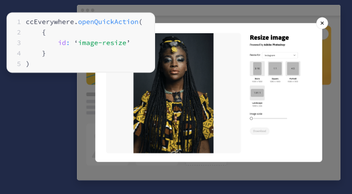
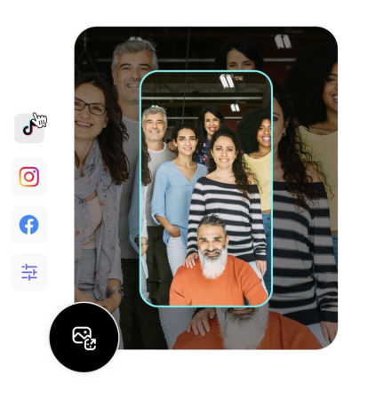
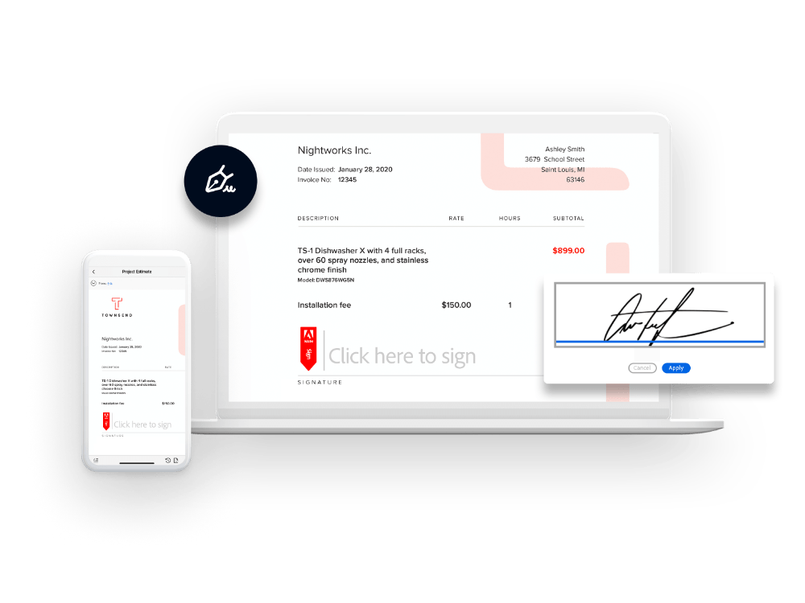

import "../styles/main.css"
import ResourceCardBlock from './quick-action/resourceCard.md'; 
import AnimationVideo from "./videos/Adobe_DCP_Marquee_Animation.json";
import QuickAction from './quick-action/quick-action.md'

<Hero slots="heading, text,  assetsImg" customLayout variant="video" animationVideo={AnimationVideo} className=" editor-express-hero quick-action-header"/>

# Embed Quick Actions to edit images and vedios

Harness the creative power of Adobe's flagship products

homeheroAssertImage

<AnnouncementBlock slots="heading, text, button" className="announcement "/>

### What are Quick Actions ? 

Fast editing tools that developers can customize and embed to give end users access to the tools within their own applications

[Try the demo](https://adobe.io)

<WrapperComponent slots="content" theme="light" className="editing-content" />

<QuickAction/>

<TextBlock slots="image,heading,text" theme="lightest" headerElementType="h2" variantsTypePrimary='secondary' variantStyleFill = "outline"    className=" zigzag-cta-two streamline_ability small-code-snippet"/>

### Small Code Snippets with Big Impact 

With Quick Actions, customize which component will be loaded into the iframe with the changes of single ID

<TextBlock slots="image, heading,text,buttons" theme="lightest" headerElementType="h2" variantsTypePrimary='secondary' variantStyleFill = "outline" homeZigZag className="streamline_ability"/>

### Resize Image

Lorem ipsum dolor sit amet, consetetur sadipscing elitr, sed diam nonumy eirmod tempor invidunt ut labor ey dolore magna aliquyam erat, set diam voluptua. At vero eos et accusam et justo duo dolores et

- [Learn more](https://adobe.io)

<TextBlock slots="heading,text,buttons,image" theme="lightest" headerElementType="h2" variantsTypePrimary='secondary' variantStyleFill = "outline"   homeZigZag className=" zigzag-cta-two streamline_ability"/>

### Insipre customer to create with confidence and efficency

Lorem ipsum dolor sit amet, consetetur sadipscing elitr, sed diam nonumy eirmod tempor invidunt ut labor ey dolore magna aliquyam erat, set diam voluptua. At vero eos et accusam et justo duo dolores et

- [Learn more](https://adobe.io)

<TextBlock slots="heading" theme="light" className="see-it-action quick-action-see"/>

#### See it in Action

<WrapperComponent slots="content" repeat="1" theme="lightest" className="acrobat letter breakout"/>

<ResourceCardBlock/>

<TextBlock slots="heading,text,buttons,image" theme="lightest" headerElementType="h2" variantsTypePrimary='secondary' variantStyleFill = "outline" className=" zigzag-cta-two streamline_ability adobeExpress-sdk"/>

### Getting Started

With the Adobe Express Embed SDK, lorem ipsum dolor sit amet, consetetur sadipscing elitr, sed diam nonumy eirmod tempor invidunt ut labour et dolre magna aliquyam erat, sed diam voluptua. at vera eos at accusam et justo

- [Get Started](https://adobe.io)
- [Try the demo](https://adobe.io)

