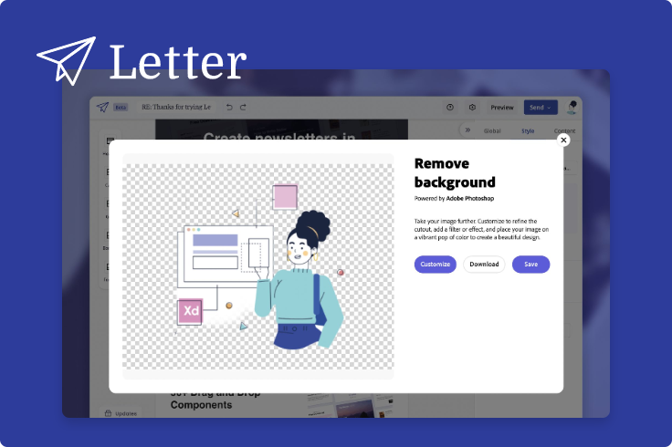

<TextBlock slots="image, heading, text" theme="light"  width="33%" className="deployment quick-action-block" />

### Adobe Stock

Users can customize images inline with the image resize and remove background Quick Actions directly in the asset licensing experience.

<TextBlock slots="image, heading, text" theme="light"  width="33%" className="deployment quick-action-block"/>

### Creative Cloud Desktop

Experience the full complement of image and video editing Quick Actions for use in any Adobe application with Creative Cloud on desktop.

<TextBlock slots="image, heading, text" theme="light"  width="33%" className="deployment quick-action-block"/>

### Letter

This online newsletter tool includes image- and video-related Quick Actions directly in the editing experience, enabling users to work within the platform.
