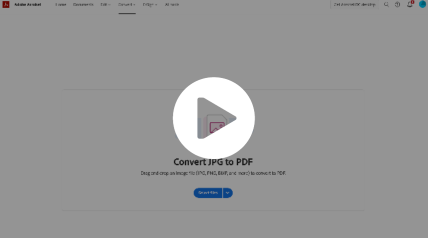
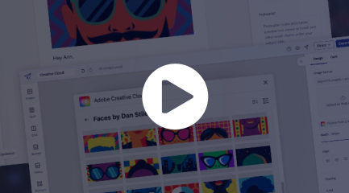
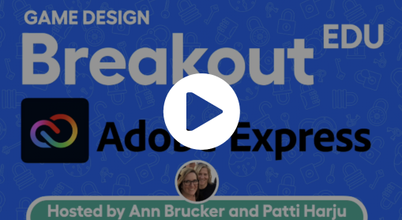

<ResourceCard slots="link, image, heading, text" width="25%"  />

<https://www.youtube.com/watch?v=0W6i5LYKCSI>

### Adobe Stock

Optional metadata should be kept to two or three lines

<ResourceCard slots="link, image, heading, text" width="25%"  />

<https://www.youtube.com/watch?v=0W6i5LYKCSI>

### Creative Cloud Desktop

Optional metadata should be kept to two or three lines

<ResourceCard slots="link, image, heading, text" width="25%"  />

<https://www.youtube.com/watch?v=0W6i5LYKCSI>

### Letter

Letter has used the Adobe Express editing features to further uplevel existing editing tools